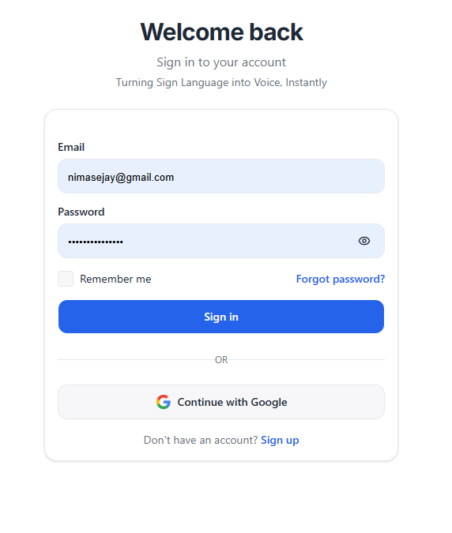
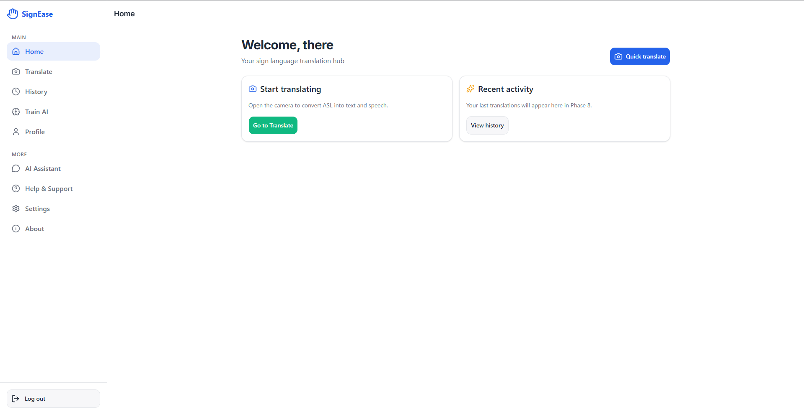
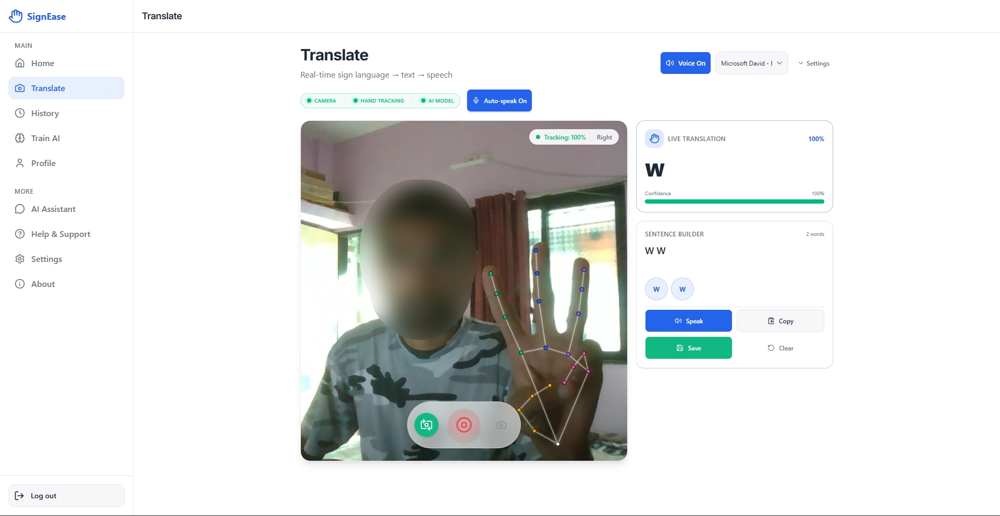
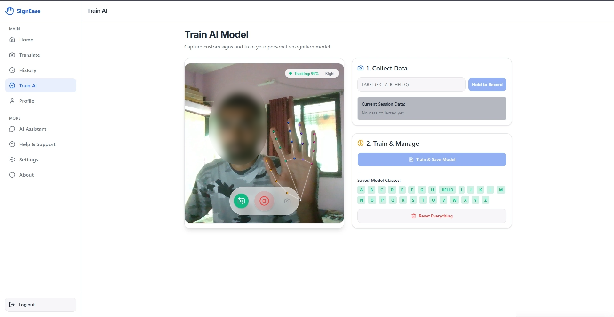
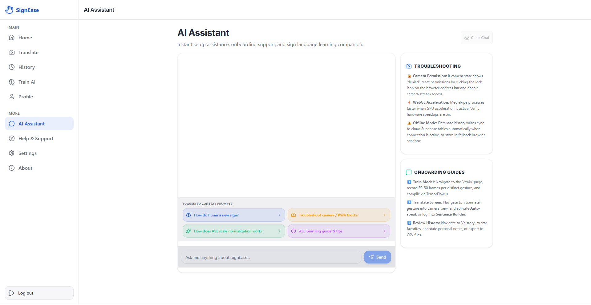

# 🤟 SignEase

> **Breaking communication barriers with AI-powered sign language recognition.**

SignEase is an **AI-powered sign language recognition system** designed to bridge communication gaps between people who use sign language and those who may not understand it.

The system uses **computer vision, image processing, and machine learning** to recognize hand gestures captured through a camera and convert them into **readable text and speech** in real time.

---

## 🌟 Overview

Communication can be challenging for people with hearing and speech impairments when others around them do not understand sign language.

**SignEase** aims to make communication more accessible by providing a system that can:

**Hand Gesture → AI Recognition → Text → Speech**

The application captures hand gestures through a camera, processes the visual input, identifies the corresponding sign, and converts the recognized gesture into text and optionally into speech using text-to-speech technology.

---

## ✨ Features

* 🤟 **Real-Time Sign Recognition**

  * Detect and recognize sign language gestures using a camera.

* 📷 **Camera Integration**

  * Capture hand gestures through a live camera feed.

* 🧠 **AI-Powered Recognition**

  * Uses machine learning and computer vision for gesture classification.

* 📝 **Sign-to-Text Conversion**

  * Converts recognized gestures into readable text.

* 🔊 **Text-to-Speech**

  * Converts recognized text into spoken audio.

* 👤 **User Authentication**

  * Login and signup functionality for users.

* 🤖 **AI Assistant**

  * Provides assistance and guidance within the application.

* 🎨 **Smart UI/UX**

  * Designed with accessibility and ease of use in mind.

---

## 🏗️ System Workflow

```text
              📷 Camera Input
                    │
                    ▼
          ┌────────────────────┐
          │  Image Processing  │
          └────────────────────┘
                    │
                    ▼
          ┌────────────────────┐
          │ Hand Detection     │
          │ & Landmark         │
          │ Extraction         │
          └────────────────────┘
                    │
                    ▼
          ┌────────────────────┐
          │ Machine Learning   │
          │ Gesture Classifier │
          └────────────────────┘
                    │
                    ▼
             🤟 Recognized Sign
                    │
              ┌─────┴─────┐
              ▼           ▼
          📝 Text       🔊 Speech
```

---

## 🛠️ Tech Stack

### Artificial Intelligence & Machine Learning

* Python
* TensorFlow
* MediaPipe
* OpenCV
* NumPy

### Frontend

* HTML
* CSS
* JavaScript

### Backend

* Node.js
* Supabase
* SQL

### Other Technologies

* Text-to-Speech API
* Git
* GitHub
* VS Code

---

## 🚀 Getting Started

### Prerequisites

Make sure you have the following installed:

* Python 3.x
* Node.js
* npm
* Git
* A working webcam

---

### 1. Clone the Repository

```bash
git clone https://github.com/YOUR-USERNAME/SignEase.git
```

Navigate to the project directory:

```bash
cd SignEase
```

---

### 2. Install Python Dependencies

```bash
pip install -r requirements.txt
```

If a virtual environment is used:

```bash
python -m venv venv
```

Activate it:

**Windows**

```bash
venv\Scripts\activate
```

**macOS / Linux**

```bash
source venv/bin/activate
```

---

### 3. Install Frontend Dependencies

If the project uses a JavaScript frontend:

```bash
npm install
```

---

### 4. Run the Application

Start the backend:

```bash
python app.py
```

Then start the frontend if required:

```bash
npm run dev
```

Open the application in your browser.

---

## 🧠 How It Works

SignEase follows a multi-stage recognition pipeline.

### 1. Camera Capture

The webcam continuously captures frames containing the user's hand gestures.

### 2. Hand Detection

**MediaPipe** is used to detect the hand and identify important hand landmarks.

### 3. Image Processing

**OpenCV** processes the captured frames and prepares the input for the recognition model.

### 4. Gesture Classification

The extracted hand landmarks/features are passed to a trained machine learning model.

The model predicts the corresponding sign.

### 5. Text Conversion

The predicted sign is converted into readable text.

### 6. Speech Generation

The generated text can then be converted into speech using a text-to-speech system.

---

## 🎯 Use Cases

SignEase can potentially be used in:

* 🏫 Educational institutions
* 🏥 Healthcare environments
* 🏢 Workplaces
* 🛍️ Customer service environments
* 🏠 Everyday communication
* 🌐 Accessibility-focused applications

---

## 📸 Screenshots

### Login / Signup



### Dashboard



### Sign Recognition



### Model Training



### AI Assistant



### Profile


---

## 🔮 Future Improvements

The project can be extended with:

* [ ] Support for a larger sign language vocabulary
* [ ] Continuous sentence recognition
* [ ] Two-way communication
* [ ] Multiple sign language support
* [ ] Improved recognition accuracy
* [ ] Mobile application
* [ ] Cloud-based model deployment
* [ ] Personalized gesture recognition
* [ ] Offline recognition
* [ ] Voice-to-sign-language conversion
* [ ] Improved AI conversational assistant

---

## ⚠️ Current Limitations

The recognition system may be affected by:

* Lighting conditions
* Camera quality
* Hand positioning
* Background complexity
* Similar-looking gestures
* Limited training data
* Recognition of continuous sentences

Improving the training dataset and model architecture can help address these limitations.

---

## 📊 Project Goals

The primary goal of SignEase is to explore how **Artificial Intelligence and Computer Vision can be applied to accessibility technology**.

The project focuses on combining:

```text
Computer Vision
       +
Machine Learning
       +
Hand Gesture Recognition
       +
Text-to-Speech
       ↓
Accessible Communication
```

---

## 👨‍💻 Developer

### Jay Nimase

**B.Tech Computer Engineering Student**
MIT Academy of Engineering, Pune

Interested in:

* Software Engineering
* Artificial Intelligence
* Machine Learning
* Computer Vision
* Full-Stack Development

---

## ⭐ Contributing

Contributions, suggestions, and improvements are welcome.

If you would like to contribute:

```bash
git fork
```

Create a new branch:

```bash
git checkout -b feature/new-feature
```

Commit your changes:

```bash
git commit -m "Add new feature"
```

Push your branch:

```bash
git push origin feature/new-feature
```

Then open a Pull Request.

---

## 📄 License

This project is intended for **educational and research purposes**.

---

## ⭐ Support

If you find SignEase interesting, consider giving the repository a ⭐ on GitHub.

**SignEase — Making communication more accessible, one gesture at a time. 🤟**
